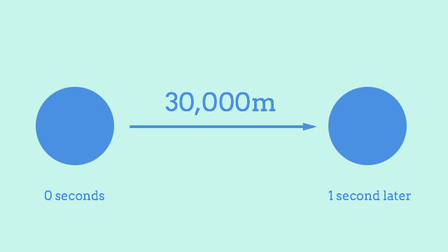

After building last week’s Solar System renderer, I was excited to move on to the fun stuff and see some planets moving around.
I rushed on into implementing motion, which on the face of it is pretty simple.
If Earth is moving along at 30,000m/s, for example, then you can just add its velocity to its current position once per second and get its new location.



The code for this is an easy read. I threw together a little Motion class. Elsewhere, it’s instantiated, and the affect method is invoked repeatedly. So if Earth has a vector of 30000 horizontally and 0 vertically, then each tick of this method counts as one second of motion in my imaginary 2D universe, and it moves the earth along by 30km each time.

```javascript
class Motion {
  affect (universe) {
    universe.planets.map((planet) => {
      planet.position.add(planet.vector);
    });
  }
}
```

This worked on my first try, which as usual, meant I’d barely broken the surface of the problem.
To give you a sense of perspective, here’s ten seconds of motion in plain old 1:1 time.
It’s not exactly riveting.
Earth’s 12,000km diameter makes 30km/s look slow.
Honestly, I kind of thought it’d be a bit quicker, even at 1:1 scale.
Remember this next time somebody’s talking about how we’re “hurtling through space on a giant rock”.
It barely moves at all in this clip. Hurtling my arse.

<video
 src="slow.mp4" 
 title="2D earth moving almost imperceptibly slowly."
 controls
 playsinline>
</video>

No way I’m waiting an entire real-life year to see my simulated Earth make its way around the Sun once.
What I needed was a way to speed up time.

Something I quickly realised was that this was more or less the same problem as the viewport scaling, just dressed up a little differently.
The symmetry carries over into the solution, too, because just like in the graphical layer, I ended up creating a scale property to represent the conversion rate.
This time, it was for converting between real life seconds and imaginary space seconds.
So a scale of 1 gives you one second per real second, and a scale of 60 gives you a minute per real second, and so on.

The timing code is too involved (💤) to show a decent summarised version here.
The gist of it is that for each tick, it multiplies the real life tick interval length by the scale factor, and passes that to any physics calculations so that they can multiply their results by that.
For motion, that just means multiplying the planet’s vector by the number of seconds elapsed before adding it to the planet’s position.

```javascript
class Motion {
  affect (universe, seconds) {
    universe.planets.map((planet) => {
      planet.position.add(planet.vector.scale(seconds));
    });
  }
}
```

Now here’s the Earth again, this time with scale pumped up to 600.
That’s 10 imaginary space minutes for every real world second.
If you’re good at maths you might notice that this video is 18 seconds long, and the timer doesn’t make it to 3 hours like it should at this scale.
But then if you were paying that kind of attention you’d have noticed that only 10 seconds pass in the 12 second video earlier! Still got some minor issues to iron out there 😇

<video
 src="fast.mp4" 
 title="2D earth moving much faster."
 controls
 playsinline>
</video>

This is going great so far. It isn’t perfect, but I’m reasonably pleased with it. Getting the foundational stuff like graphics and timing right makes it so much more enjoyable to build the complicated stuff on top.
